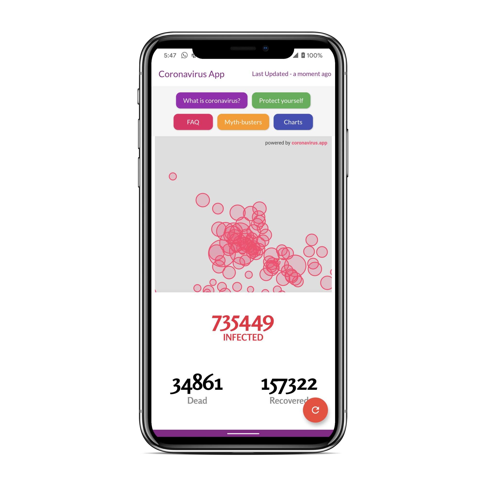
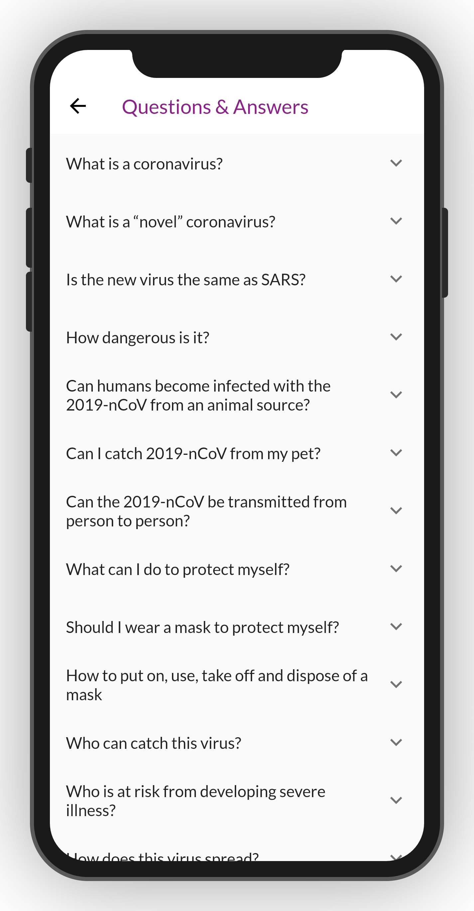
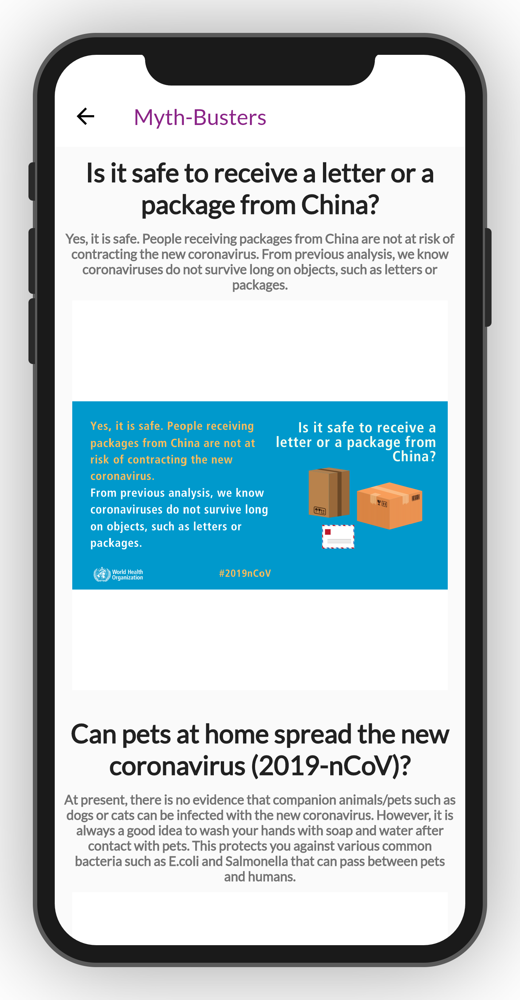
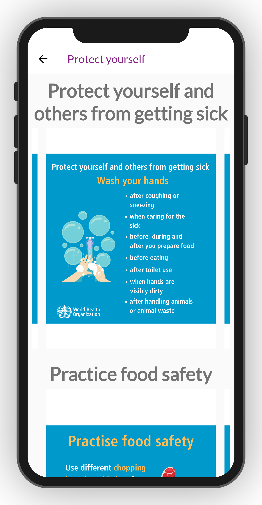

# Coronavirus Warrior App

A Flutter project to track & help to fight from coronavirus.

## What is Coronavirus Warrior?

Coronavirus Warrior is a cross-platform mobile app. It is written in Dart using [Flutter](https://flutter.dev).

Download the app from [here](https://school.mtechviral.com/coronavirus-warrior-app).

### Show some :heart: and star the repo.

## YouTube Channel

[MTechViral](https://www.youtube.com/mtechviral)

## Facebook Group

[Let's Flutter With Dart](https://www.facebook.com/groups/425920117856409/)

## Collection of flutter apps with tutorial

[Flutter Example Apps](https://github.com/iampawan/FlutterExampleApps)

# Screenshots

 
 

# Contributing

- Fork the repository and clone it to your local machine
- Follow the instructions [here](https://flutter.dev/docs/get-started/install) to install the Flutter SDK
- Setup [Android Studio](https://flutter.dev/docs/development/tools/android-studio) or [Visual Studio Code](https://flutter.dev/docs/development/tools/vs-code).

## Building

Android (armeabi-v7a): `flutter build apk`
Android (arm64-v8a): `flutter build apk --target=android-arm64`
iOS: `flutter build ios`

If you have a connected device or emulator you can run and deploy the app with `flutter run`

## Have a question?

If you need any help, feel free to file an issue if you do not manage to find a solution.

## License

Coronavirus Warrior is released under the MIT License

### :heart: Found this project useful?

If you found this project useful, then please consider giving it a :star: on Github and sharing it with your friends via social media.

## Project Created & Maintained By

### Pawan Kumar

Google Developer Expert for Flutter. Passionate #Flutter, #Android Developer. #Entrepreneur #YouTuber

 

# Donate

> If you found this project helpful or you learned something from the source code and want to thank me, consider buying me a cup of :coffee:
>
> - [PayPal](https://www.paypal.me/imthepk/)

A few resources to get you started if this is your first Flutter project:

- [Lab: Write your first Flutter app](https://flutter.dev/docs/get-started/codelab)
- [Cookbook: Useful Flutter samples](https://flutter.dev/docs/cookbook)

For help getting started with Flutter, view our
[online documentation](https://flutter.dev/docs), which offers tutorials,
samples, guidance on mobile development, and a full API reference.
